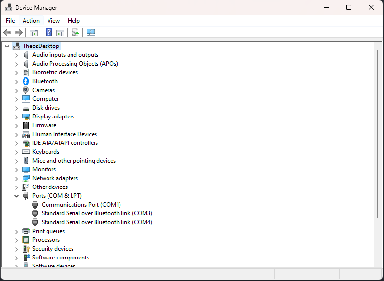

# LED-Controller-Software
repository for creating scripts for the prizmatix led control software

## CREATED BY THEO XENAKIS - Free to use for Prizmatix LED-Ctrl users    

## Script: led-controller.py

## Getting Started:
1) Install Python 3.6 or higher from https://www.python.org/downloads/
2) Install the 'pyserial' library by running 'pip install pyserial' in your command line
3) Connect your Prizmatix LED Controller to your computer via USB
4) Open Device Manager (Windows) or System Information (Mac) to find the COM port
        