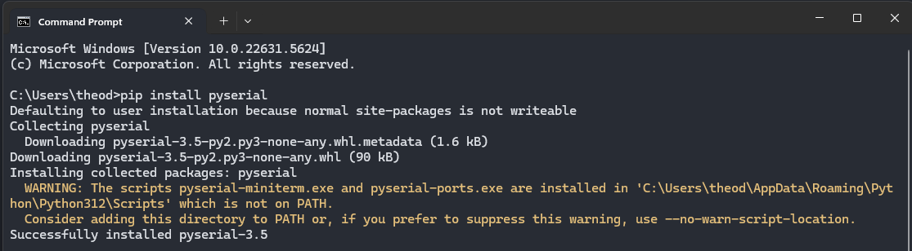
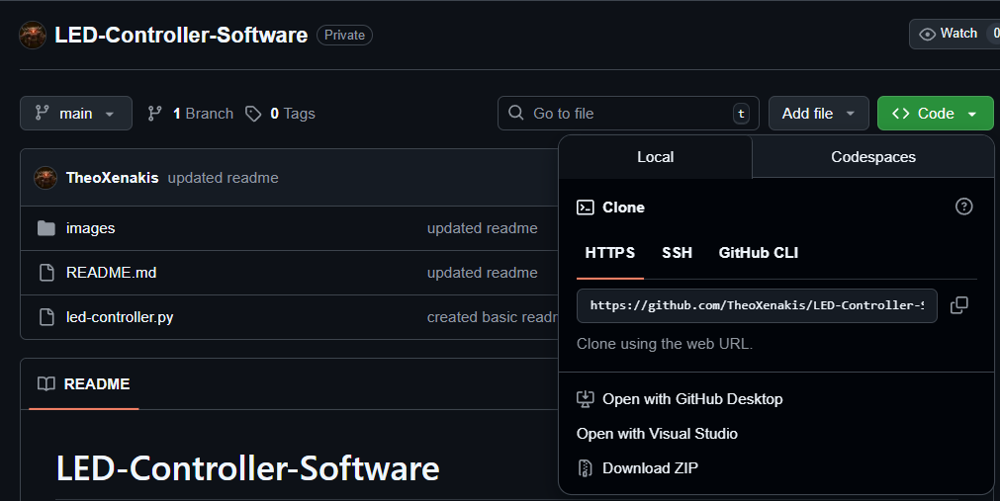
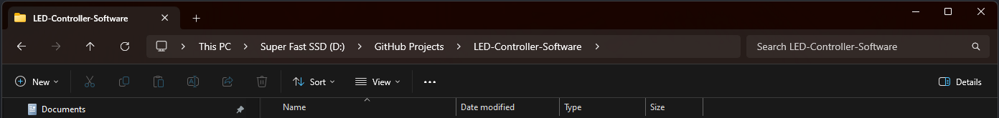
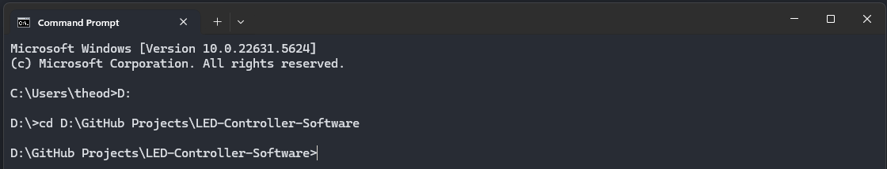
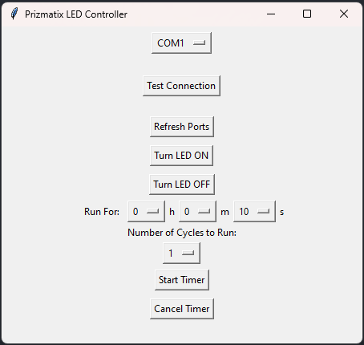

# LED-Controller-Software
repository for creating scripts for the prizmatix led control software

## CREATED BY THEO XENAKIS - Free to use for Prizmatix LED-Ctrl users    

## Script: led-controller.py

## Getting Started:

### NOTE: TEMPORARY SETUP INSTRUCTIONS WHILE TESTING ON/OFF INPUTS WITH DEVICE

### If you have never used python before, this is for you!
1) Install Python 3.6 or higher from https://www.python.org/downloads/
2) Install the 'pyserial' library by running 'pip install pyserial' in your command line
    
3) Click the Green <> Code button at the top of the GitHub page and press Download ZIP.
    
3) Extract the zip at the current location or wherever you prefer.
4) Open your command prompt and navigate to the folder where the extracted zip is. 
    * You can navigate forward with 'cd', and list files in your current directory with 'dir'. Further, you can navigate back with 'cd..'. (do not include the apostrophes for any of these) 
    * Go to your download location, click the bar at the top that says something like > This PC > SSD, etc. This selects your full path. Then press ctrl-C to copy the full directory path.
    
    * In the command prompt, type the following: cd D:\GitHub Projects\LED-Controller-Software (replace with your path you just copied)
    * A NOTE: if you are currently in C drive, and need to navigate to D drive (as an example) - simply type D: and you will move to the other drive
    
5) Run the test using the following command: python led-controller.py

### LED Control Setup
1) Once the program has been opened, you should see this window:
    
2) View the Ports list.
3) Connect your device and hit the 'refresh list' button.
4) Select the new port that just appeared.
5) Now run the program for your desired duration!
